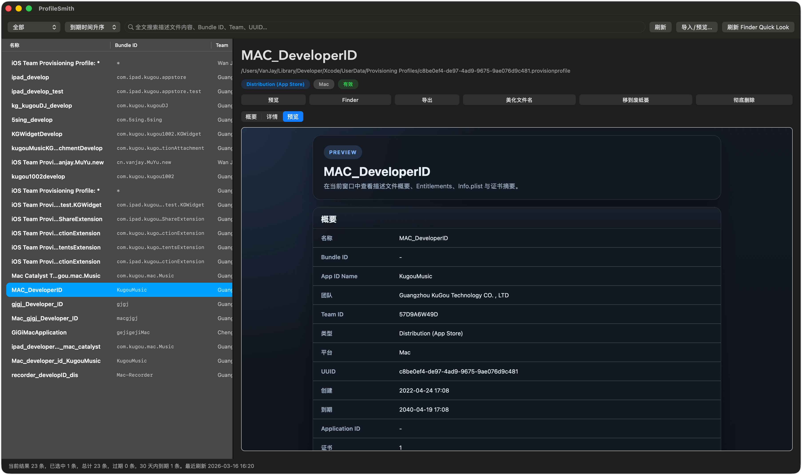
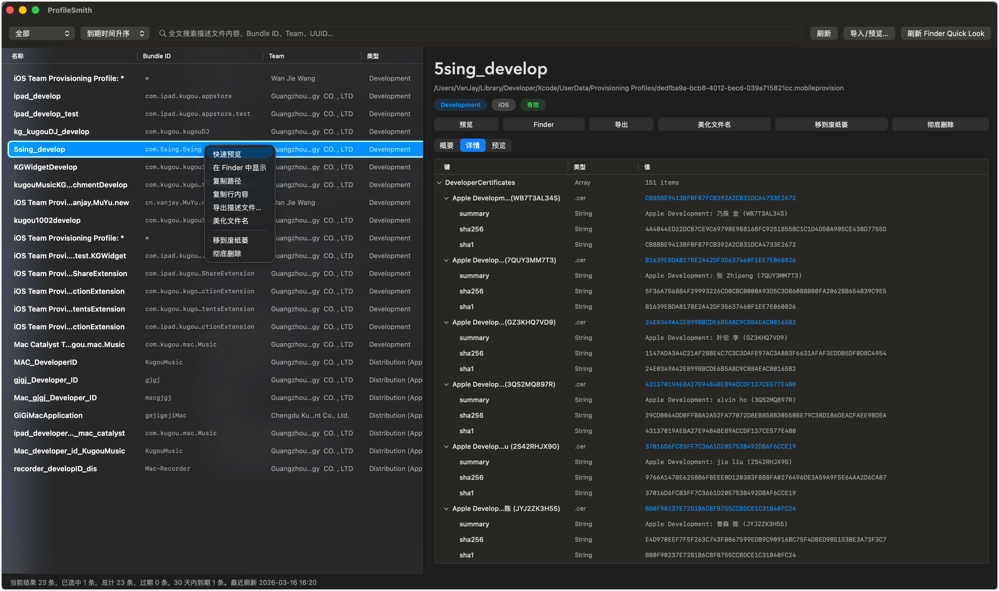
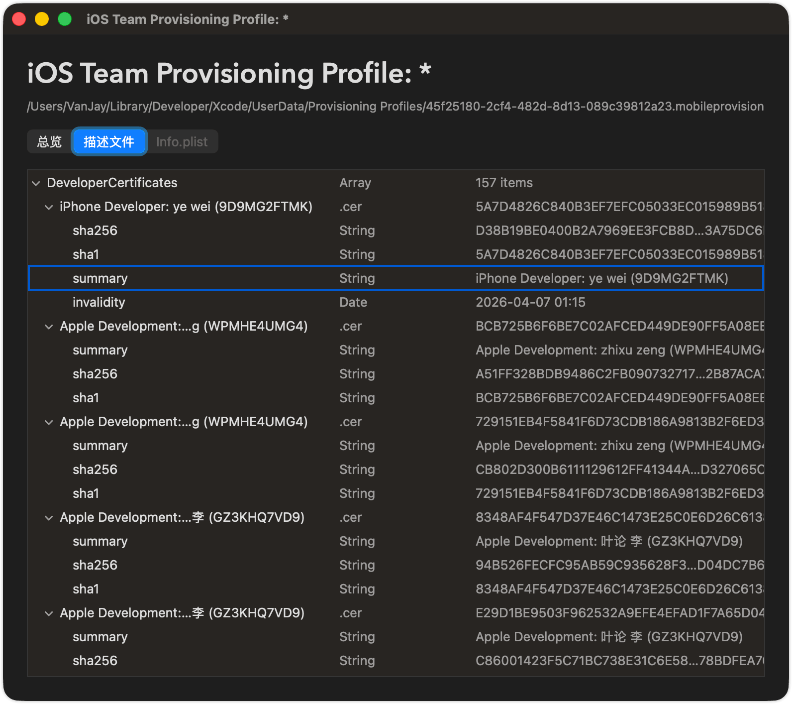

# ProfileSmith

ProfileSmith 是一个原生 macOS 描述文件管理器，用来索引、搜索、预览和维护 `.mobileprovision`、`.provisionprofile`，以及包含嵌入描述文件的 `.ipa`、`.xcarchive`、`.app`、`.appex`。

## 功能

- 扫描 `~/Library/MobileDevice/Provisioning Profiles` 和 `~/Library/Developer/Xcode/UserData/Provisioning Profiles`
- SQLite + GRDB 建索引，支持按名称、Bundle ID、Team、UUID、类型全文搜索
- 详情面板展示概要、Entitlements、证书摘要和原始 plist 结构
- 支持导入、导出、Finder 定位、移到废纸篓、彻底删除、文件名美化
- 已声明描述文件文档类型，可在 Finder 中通过“打开方式”使用 ProfileSmith 打开 `.mobileprovision` / `.provisionprofile`
- 内建 Finder Quick Look 扩展，使用原生 AppKit 预览描述文件、IPA、XCArchive、App、App Extension
- 集成 Sparkle / GitHub Releases 更新检查，并可在偏好设置里配置检查策略

## 截图

<p>
  
</p>
<p>
  
</p>
<p>
  
</p>

## 工程结构

- `ProfileSmith/`: 主应用代码
- `ProfileSmithQuickLookExtensions/`: Quick Look 预览与缩略图扩展
- `ProfileSmithTests/`: 单元测试
- `ProfileSmithUITests/`: UI 测试
- `scripts/`: DMG、GitHub Release、appcast 相关脚本
- `release-notes/`: 每个版本的发布说明

## 本地开发

要求：

- Xcode 26 或更新版本
- macOS 10.15 及以上

常用命令：

```bash
xcodebuild test \
  -project ProfileSmith.xcodeproj \
  -scheme ProfileSmith \
  -derivedDataPath /tmp/ProfileSmithDerivedData \
  -destination 'platform=macOS' \
  -only-testing:ProfileSmithTests \
  CODE_SIGNING_ALLOWED=NO
```

主工程使用本地依赖：

- `Vendor/GRDB.swift`
- `Vendor/SnapKit`
- `Vendor/Sparkle`

## 使用说明

1. 启动后左侧会自动显示已索引的描述文件。
2. 选中单个条目后，右侧可以查看概要、原始结构和内建预览。
3. 拖入 `.mobileprovision` / `.provisionprofile` 会执行导入。
4. 拖入 `.ipa` / `.xcarchive` / `.app` / `.appex` 会打开预览窗口。
5. 通过“偏好设置…”可以切换更新策略：手动检查、每天自动检查、启动时检查。
6. 在 Finder 中右键描述文件，选择“打开方式 -> ProfileSmith”可以直接进入应用内预览或管理。

## 发布

版本号来自：

- 主应用：`ProfileSmith.xcodeproj/project.pbxproj`
- Quick Look 扩展：`ProfileSmithQuickLookExtensions/ProfileSmithQuickLookExtensions.xcodeproj/project.pbxproj`

常用脚本：

- `./scripts/build_dmg.sh`
- `./scripts/publish_github_release.sh`
- `./scripts/generate_appcast.sh`

典型流程：

1. 更新 `MARKETING_VERSION` / `CURRENT_PROJECT_VERSION`
2. 编写 `release-notes/vX.Y.md`
3. 构建并签名 DMG
4. 发布 GitHub Release
5. 生成并提交 `appcast.xml`

## 1.3.0 更新

- 优化 Finder“打开方式 -> ProfileSmith”处理逻辑：已存在文件直接定位，未导入文件自动导入并在左侧列表中选中。
- 修复右侧预览页右键菜单仍会出现 Reload 且可能导致内容空白的问题。
- 新增“平台”列，修复表头再次点击无法反向排序、状态列表头异常和最右侧多余分隔线。
- 调整 split view 左侧最小宽度与“名称”列最小宽度一致，并修复外部文件拉起应用时主窗口不会切到前台的问题。

## 1.2.2 更新

- 修复右侧详情 pane 在启动阶段可能触发的 Auto Layout 冲突日志
- 修复 split view 稳定逻辑在布局过程中重复触发布局，消除控制台递归布局警告

## 1.2.1 更新

- Finder Quick Look 预览改为原生 AppKit 视图，不再依赖 HTML / WKWebView
- README 新增最新主界面与预览窗口截图

## 1.2 更新

- 修复美化文件名后描述文件可能消失的问题
- 新增 Finder 中对 `.mobileprovision` / `.provisionprofile` 的“打开方式 -> ProfileSmith”
- 增加主界面与预览窗口的复制快捷键与右键拷贝
- 优化主界面加载态、右侧预览页布局与暗色主题适配
- 修复主列表列宽拖拽与顶部刷新指示器状态异常
